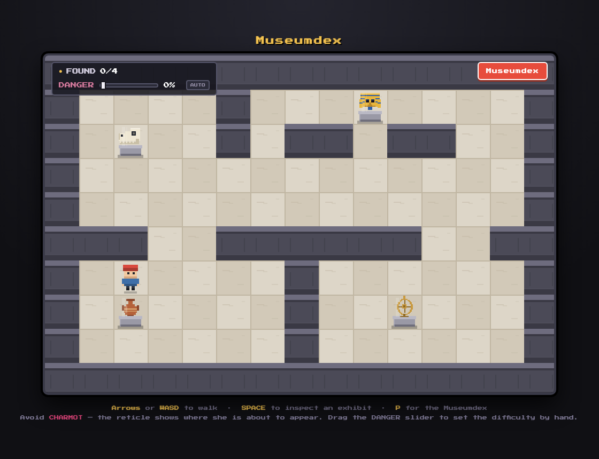

# Museumdex

A small Pokémon-style museum explorer built with [Phaser 3](https://phaser.io/).
Walk the galleries, inspect the exhibits to register them in your Museumdex, and
don't let CHARMOT touch you.

**[▶ Play it](https://mathijsrochus.github.io/pokemon-museum-demo/)**



## Controls

| Key | Action |
|-----|--------|
| Arrow keys / WASD | Walk |
| SPACE | Inspect the exhibit in front of you, then advance the text |
| P | Open the Museumdex |
| ESC | Close it again |

Stand directly below a plinth to inspect it — a gold chevron appears over
anything you can interact with.

## Running it locally

There is no build step and nothing to install. Open `index.html` in a browser,
or serve the folder if you prefer:

```sh
python3 -m http.server 8000
```

Phaser is loaded from a CDN, so an internet connection is needed on first load.

## How it works

**Every pixel is generated at runtime.** There are no image files. `game.js`
draws the marble floor, the walls, each exhibit, the player's 16-frame walk
spritesheet and CHARMOT herself into canvas-backed Phaser textures when the
scene starts. The `px()` helper inside `makeTexture()` is the whole drawing API.

**The museum is a grid.** `mapGrid` holds `0` for floor, `1` for wall, and any
value of `2` or above for an exhibit. Movement is tile-to-tile with a short
tween; the player's logical position updates at the *start* of a step, which
matters for how CHARMOT picks her spawns.

**CHARMOT is a four-state cycle**, not a wandering NPC:

```
HIDDEN ──▶ TELEGRAPH ──▶ SOLID ──▶ FADING ──▶ HIDDEN
(gone)     (visible,      (visible,  (visible,
            harmless)      LETHAL)    harmless)
```

Only `SOLID` kills. `TELEGRAPH` puts a reticle on the tile she is about to
occupy, so every death is one the player could see coming. She also freezes
completely while any overlay is open — otherwise you could die mid-sentence
while reading an exhibit.

**Difficulty lives in one function.** `difficultyFor(threat)` maps a single
`0..1` scalar onto every parameter — how long the warning lasts, how long she
stays lethal, how close she may appear, how many of her there are, and whether
she gives chase. `threat` climbs automatically as `time² + 0.15 per discovery`,
and the DANGER slider in the HUD overrides it so you can demo any difficulty
instantly.

**Fairness rules** are enforced in `pickSpawnTile()`: never on your tile or the
one you are already moving into, never inside a wall, and never without leaving
you at least one free adjacent tile to escape to. If no fair tile exists she
waits rather than forcing a spawn.

## Adding an exhibit

The mock API is the source of truth — everything else follows from it. Three
steps:

1. Add an entry to `MuseumAPI` in `game.js`, keyed `exhibit_<n>` where `<n>` is
   the tile value you want to use.
2. Add a matching drawing function to `EXHIBIT_ART`.
3. Put `<n>` on the map in `mapGrid`, with a walkable tile directly below it.

The texture, the plinth, the dialogue, the tick badge on discovery, the
Museumdex listing, the numbering and the `x/y` progress counter all pick it up
on their own.
